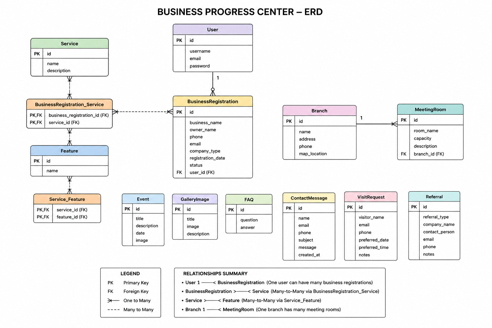

# Progress Business Center 🏢

Progress Business Center is a modern business center management web application developed with **Python** and **Django**. The platform allows entrepreneurs, startups, and businesses to explore office solutions, register their businesses, arrange visits, browse available services, and connect with Progress Business Center through an intuitive and professional interface.

The system is designed to simplify the customer journey by providing information about office solutions, meeting rooms, company branches, business events, and registration services, while giving administrators complete control over the website's content through Django's administration panel.

---

## 🌐 Live Demo

> Coming Soon

---

## ✨ Features

### Public Users

* Browse available office services
* Explore office features
* View company branches and locations
* Browse gallery and business events
* Read frequently asked questions
* Contact the company
* Arrange a business visit

### Registered Business Clients

* Secure user authentication (Sign Up / Log In / Log Out)
* Register a business
* Request one or multiple business services
* Manage personal business registrations

### Administration

* Manage services
* Manage office branches
* Manage meeting rooms
* Manage gallery
* Manage events
* Manage FAQs
* Review contact messages
* Review visit requests
* Manage business registrations

---

## 🛠️ Technologies & Tools

* Python
* Django
* SQLite (Development)
* Django Templates (DTL)
* HTML5
* CSS3
* Git & GitHub
* Trello (Project Management)

---

## 📐 Planning & Design

### 🎨 Wireframes

Progress Business Center Website

https://www.progressoffices.com/

---

### 🗂️ Project Board (Trello)

> Coming Soon

---

## 🧩 Entity Relationship Diagram (ERD)

  

## 🚀 Planned Models

* User (Django Authentication)
* Business Registration
* Service
* Feature
* Branch
* Meeting Room
* Event
* Gallery Image
* FAQ
* Contact Message
* Visit Request
* Referral

---

## 🚀 Future Enhancements

* Online meeting room reservations
* Business registration status tracking
* Email notifications
* Search and filtering
* Interactive Google Maps integration
* Responsive mobile optimization
* Business dashboard for registered clients
* Admin analytics and reporting
* Online payments for office services

